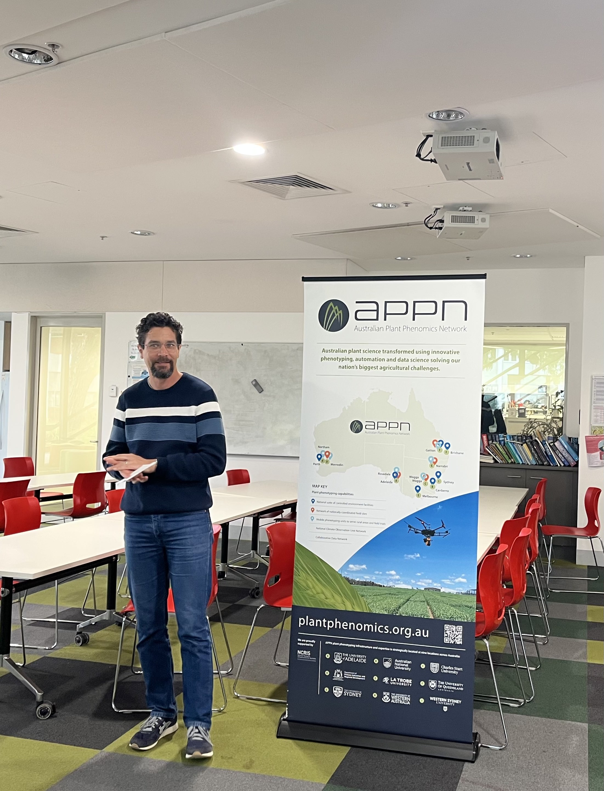
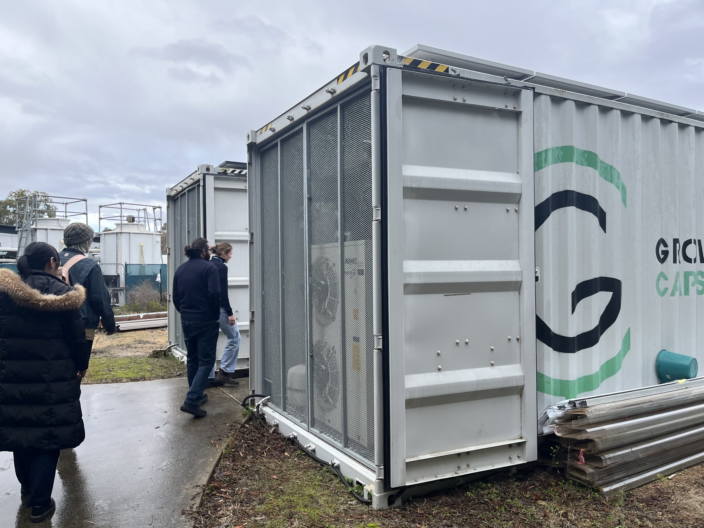
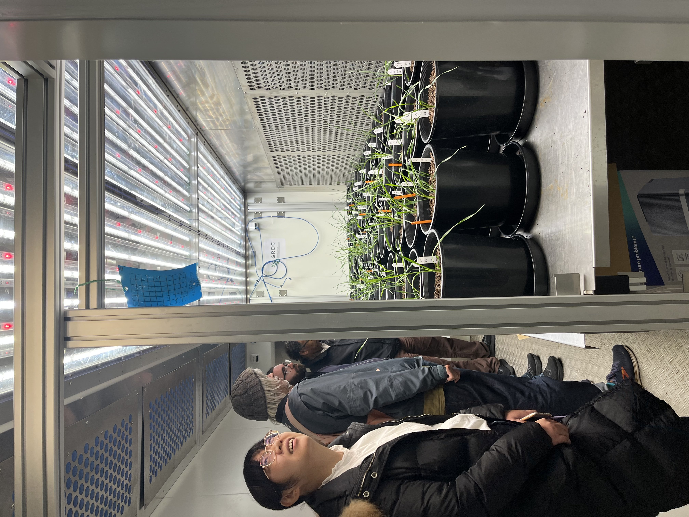
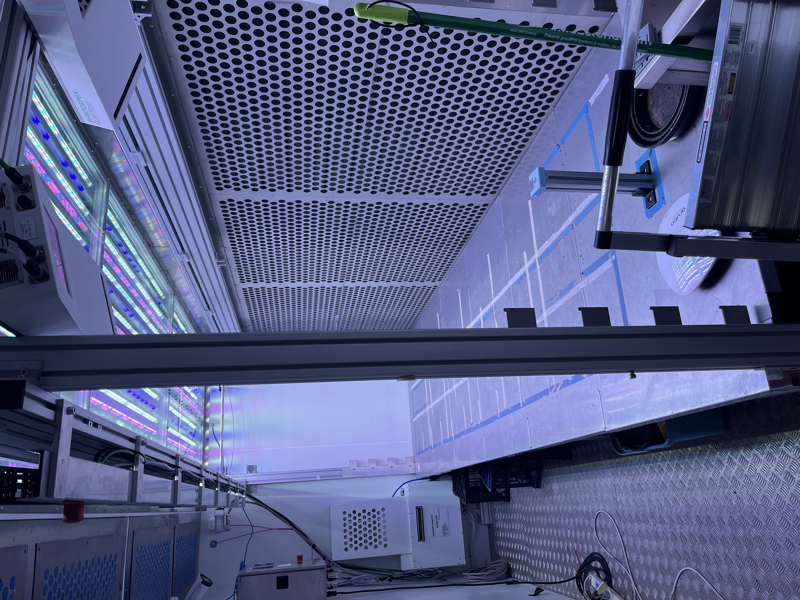
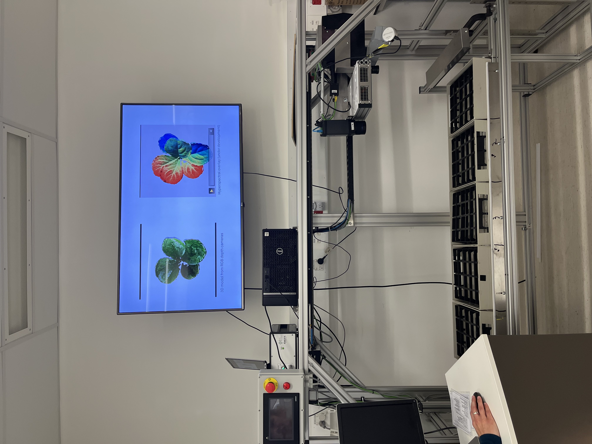
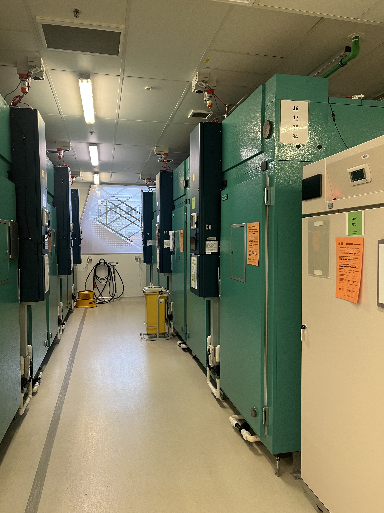
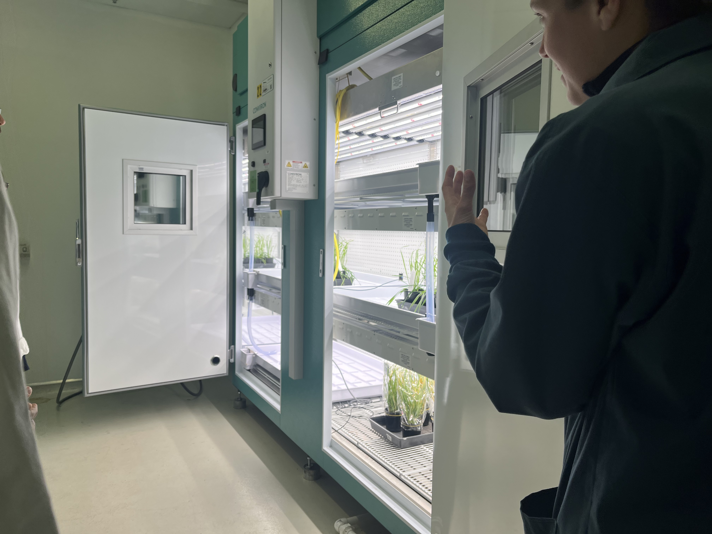

```{=html}
<style>
.quarto-layout-cell img {
  height: 350px;
  object-fit: cover;
  width: 100%;
}
</style>
```

On the 12th of August 2026, The ANU-APPN (Australian Plant Phenomics Network) hosted a facility tour of its faculties at the ANU Research School of Biology. Our tour group was given an opening remark by Dr. Richard Poire, the director of the ANU chapter of the Australian Phenomics Network. 


{width="30%"}

A notable thing mentioned in the opening remark was how rapid the network has grown. With the new strategic plan introduced in 2023, the number of nodes grew from two nodes in the University of Adelaide and Australian National University into 9 total nodes spread across the entire nation. We were also given an overview of operations at ANU-APPN and we understood that they are developing a national plant phenotyping asset that will deliver results in the field of plant science to be used by researchers.

Our tour began at the growth pods tucked behind the Forestry Building at ANU. These climate-controlled chambers allow researchers to precisely simulate lighting, oxygen levels, and other environmental conditions required for plant growth research. The facility is currently in active use by PhD students conducting cutting-edge research, with enough capacity to accommodate a wide range of plant species simultaneously.

::: {layout-ncol=2}

{.lightbox group="g1"}

{.lightbox group="g1"}

:::

Another notable facility we were shown is a multispectral 3d laser scanner that scans plants reconstructs a 3d scan of them. It moves over the plants and combines 3D laser triangulation with multispectral imaging to build a detailed 3D model of each plant, capturing traits like height, leaf area, and canopy structure. Because it works optically rather than through physical contact, researchers can gather this fine-grained data repeatedly over time without disturbing or damaging the plant structures. What was insightful to me is the software used to capture this information is also developed by the APPN, exhibiting the importance of software engineers to the research process.

::: {layout-ncol=2}

{.lightbox group="g2"}

{.lightbox group="g2"}

:::

Deeper inside the Linnaeus Way building, we were introduced to Conviron growth chambers, compact units used to maintain controlled conditions such as lighting, temperature, and humidity for plant research. Unlike the larger growth pods, these chambers are designed for smaller-scale experiments, with multiple shelves allowing several plant samples to be grown under monitored conditions at once.

::: {layout-ncol=2}

{.lightbox group="g3"}

{.lightbox group="g3"}

:::

We concluded the facility tour with Dr. Poire mentioning the other cutting edge research being done across other APPN nodes, how well the team is adhering to the 2023 - 2028 strategic plan, and hopes for future improvement. All-in-all, it was an insightful facility tour that broadened my horizons on plant research being conducted at ANU and across Australia.