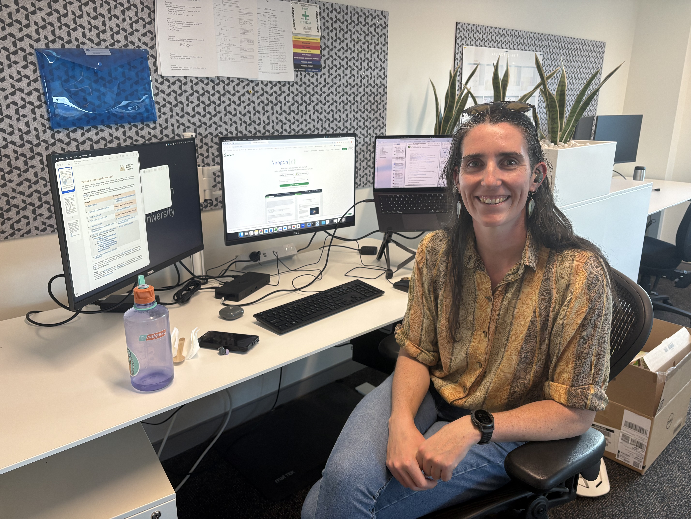

We are delighted that Maeve has joined the ANU AAGI team 😊 Maeve developed the reduced rank (or better known as factor analytic) covariance structure in the `glmmTMB` R package. Her work has already amassed over 580 citations, and some of us in the team were using her development well before she joined us! We’re very pleased to have her expertise as part of the team and look forward to supporting her continued work in software development and mixed models.

{width="30%"}